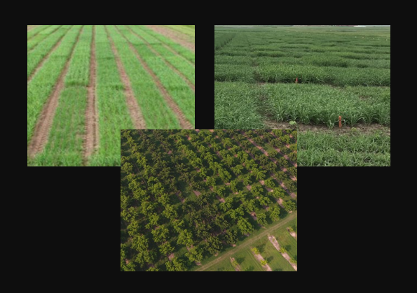

[]()

# WISER: WhItening and successive least Squares Estimation Refinement for phenotype estimation

##### Licence, status and metrics
[](https://www.gnu.org/licenses/gpl-3.0)
[]()
[](https://www.repostatus.org/#active)


  

  

##### Languages and technologies
[](https://www.r-project.org/)

## Overview

The ```wiser``` package offers *user-friendly* advanced tools for more accurate phenotypic estimation, by leveraging genetic covariance information to correct for population structure in experimental designs. By employing a whitening transformation followed by successive ordinary least squares (OLS) estimation, ```wiser``` refines fixed effect estimates and eliminates biases, leading to improved phenotypic estimation. This approach is particularly beneficial in complex experimental designs where genetic and environmental factors are intricately linked. ```wiser``` includes methods for computing whitening matrices, fixed effects, residuals, and estimating phenotypes. Additionally, the package provides fast and stable variance component estimation using a parallelized approximate Bayesian computation (ABC) algorithm, specifically designed for large datasets associated with complex experimental designs.

For an experimental design, ```wiser``` solves the following model, in order to estimate a vector $v=(v_1,...,v_q)'$ of $q$ phenotypes which approximate the genetic values associated to $q$ genotypes: 
<br><br>

$$
\\
Y = WX\beta + Zv + \varepsilon = \tilde{X}\beta + \xi 
\\
$$

where :

* $Y \ (n \times 1)$ is the vector of individual phenotypic measurements, with values repeated for each genotype.

* $W \ (n \times n)$ is a whitening matrix built using omic data (e.g., SNP markers, metabolites, or wavelength reflectances), which corrects the fixed effects variables for population structure.

* $X \ (n \times l)$ is the incidence matrix linking fixed effects to individual phenotypic measurements.

* $\beta \ (l \times 1)$ is the vector of fixed effects.

* $v \ (q \times 1)$ corresponds to a vector of $q$ phenotypes approximating the genetic values associated with $q$ genotypes.

* $Z \ (n \times q)$ corresponds to the design matrix which links the q phenotypes to the individual phenotypic values in the experimental design.

* $\varepsilon \ (n \times 1)$ is the vector of residuals.

* $\tilde{X} = X W$ and $\xi = Zv + \varepsilon$.

In the ```wiser``` framework, the whitening matrix $W$ can be constructed using three different procedures: zero-phase component correlation analysis (```ZCA-cor```), principal component correlation analysis (```PCA-cor```) and cholesky (```Cholesky```). 
Let $\Sigma_u = \sigma^2_uZKZ'$ represent the genetic covariance matrix for the vector $U = Zu = (U_1,U_2, \ldots, U_n)$, which corresponds to the vector of individual genetic effects in the experimental design.
In  ```wiser```, the vector $u=(u_1,...,u_q)'$, representing the genetic values associated with $q$ genotypes, is assumed to follow the distribution $u \sim \mathcal{N}_q(0,\sigma^2_uK)$, where $K$ is the genetic covariance matrix between genotypes, estimated from omic data.<br>
Define $R_u = V^{-\frac{1}{2}} \Sigma_u V^{-\frac{1}{2}}$ as the correlation matrix associated with $\Sigma_u$, where $V=diag(\Sigma_u)$ is a diagonal matrix with the variances of $\Sigma_u$ on its diagonal. The matrices $\Sigma_u$ and $R_u$, which are symmetric and positive semi-definite, have the following spectral decompositions: $\Sigma_u = U \Lambda U'$ and $R_u = G \Theta G'$, where $U$ and $G$ are orthogonal eigenvectors matrices for $\Sigma_u$ and $R_u$, respectively, while $\Lambda$ and $\Theta$ are diagonal matrices of positive eigenvalues for $\Sigma_u$ and $R_u$, respectively. <br>
The inverse square root matrices of $\Sigma_u$ and $R_u$ are given by $\Sigma_u^{-\frac{1}{2}} = U \Lambda^{-\frac{1}{2}} U'$ and $R_u^{-\frac{1}{2}} = G \Theta^{-\frac{1}{2}} G'$. These satisfy $\Sigma_u^{-1}=\Sigma_u^{-\frac{1}{2}}\Sigma_u^{-\frac{1}{2}}$ and  $R_u^{-1} = R_u^{-\frac{1}{2}}R_u^{-\frac{1}{2}}$. 
According to Kessy $\textit{et al.}$ (2015), the whitening matrices associated to  ```ZCA-cor```, ```PCA-cor``` and ```Cholesky``` are given by :
<br><br>

$$
\begin{cases}
  W^{ZCA-cor} = R_u^{-\frac{1}{2}}V^{-\frac{1}{2}} = G \Theta^{-\frac{1}{2}} G'V^{-\frac{1}{2}} = G \big[ \Theta^{-\frac{1}{2}} G'V^{-\frac{1}{2}} \big]\\      
  W^{PCA-cor} = \Theta^{-\frac{1}{2}} G'V^{-\frac{1}{2}}\\
  W^{Cholesky} = L^{-1} \\
\end{cases}
$$

where $L$ is derived from the Cholesky decomposition of $\Sigma_u = LL'$. The ```PCA-cor``` whitening procedure can be seen as standardizing variables using $V^{-\frac{1}{2}}$, followed by a rotation using the transposed correlation eigenmatrix $G'$, and then scaling using the inverted correlation singular values matrix $\Theta^{-\frac{1}{2}}$. ```ZCA-cor``` whitening extends this by applying an additional rotation $G$ to revert to the original basis of the standardized variables. Each whitening method is optimal according to specific criteria. For instance, ```ZCA-cor``` is unique in ensuring that the whitened variables retain the maximum correlation with the original variables. Details of these criteria and the optimality of each method are discussed in Kessy $\textit{et al.}$ (2015).

The rationale for transforming $X$ into $\tilde{X}$ through whitening, to adjust fixed effect variables for population structure, is comprehensively addressed in Jacquin $\textit{et al.}$ (2025). In contrast, the chosen approach of successive ordinary least squares (OLS) in ```wiser``` avoids making assumptions about the properties of $\beta$ and $v$. Specifically, ```wiser``` does not assume that $v$ is a random vector drawn from a distribution with a specified covariance matrix. This approach prevents enforcing an unnecessary covariance structure during the estimation of $v$, which could be detrimental. <br>
For example, assuming $v \sim \mathcal{N}_q(0,\sigma^2_vI_q)$ is often unrealistic and would lead to using a decorrelated covariance structure in the best linear unbiased predictor (BLUP) of $v$, which can be highly undesirable. <br>
Crucially, the successive ordinary least squares (OLS) procedure implemented in ```wiser``` operates without such assumptions, ensuring that the estimation of $v$ remains independent of omic information or any imposed covariance structure. The only assumptions in the ```wiser``` framework are $u \sim \mathcal{N}_q(0,\sigma^2_u K)$ and $\varepsilon \sim \mathcal{N}_n(0,\sigma^2_e I_n)$, which are necessary to estimate 
$\sigma^2_u$ for constructing the whitening matrix $W$. In this framework, the estimation of $\sigma^2_u$ and $\sigma^2_e$ is performed using an ABC algorithm. 

In ```wiser```, two kernel functions are also provided to build $K$: ```linear``` and ```identity```. The ```identity``` kernel, which is **not estimated from omic data**, is generally discouraged due to its poor phenotypic predictive ability. The ```identity``` kernel is used solely to assess the impact of including or excluding the genetic covariance structure. The ```linear``` kernel is used by default in ```wiser```.

## Installation

You can install the latest version of the ```wiser``` package with :

```R
install.packages("devtools")
library(devtools)
install_github("ljacquin/wiser")
```

## Key Features

    ▸ Phenotype estimation: estimate phenotypic values that approximate genetic values, by applying 
    whitening methods to correct for genetic covariance structure in experimental designs (i.e., 
    population structure correction).
    ▸ Whitening methods: implement various whitening techniques, such as ZCA-cor, PCA-cor, and Cholesky,
    to effectively correct for population structure.
    ▸ Genetic covariance matrix regularization: ensure the stability of genetic covariance matrices, 
    by applying regularization and shrinkage techniques which ensure positive definiteness.
    ▸ Optimal whitening and regularization: automatically determine the best whitening method and 
    regularization parameter optimizing phenotypic predictive ability, through k-fold cross-validation 
    using a subset of the data.
    ▸ Fast and stable variance component estimation: use a parallelized ABC algorithm to achieve fast and 
    stable variance component estimation in large datasets associated to complex experimental designs.
  
## Main Functions

    ▸ estimate_wiser_phenotype: estimates phenotypic values approximating genetic values using whitening 
    methods.
    ▸ optimize_whitening_and_regularization: finds the optimal combination of whitening method and 
    regularization parameter through cross-validation for phenotype prediction.

## Examples of phenotypic estimation using WISER

Below are straightforward examples demonstrating the use of the ```estimate_wiser_phenotype``` function for phenotype estimation, across the following four species: apple, pine, maize and rice. The datasets used are small subsets derived from the original datasets featured in Jacquin $\textit{et al.}$ (2025). These subsets are provided for illustrative purposes within the WISER package and are not intended to serve as reference populations for genomic prediction or GWAS. They include genomic data and raw individual phenotypic measurements for 30 randomly selected genotypes associated with an experimental design specific to each one of the four species.

### Phenotypic estimation for apple data (Jung et al., 2020)

```R
# ➡️ Load wiser library, display package help ,and attach apple data

# Load library
library(wiser)

# Show help for library
help(package = "wiser")

# Attach apple data
data("apple_raw_pheno_data")
data("apple_genomic_data")

# Display apple data
head(apple_raw_pheno_data)
head(apple_genomic_data)[, 1:10]

# For the individual phenotypic data, create the Envir variable in apple_raw_pheno_data by combining 
# Country, Year, and Management. This variable represents the environments (i.e., levels)
apple_raw_pheno_data$Envir <- paste0(
  apple_raw_pheno_data$Country, "_",
  apple_raw_pheno_data$Year, "_",
  apple_raw_pheno_data$Management
)

# For the genomic data, assign genotypes as row names (if necessary) to comply with wiser
# functions, and remove the "Genotype" column (if present)
rownames(apple_genomic_data) <- apple_genomic_data$Genotype
apple_genomic_data <- apple_genomic_data[, -match(
  "Genotype",
  colnames(apple_genomic_data)
)]

# Define a trait for phenotypic estimation using wiser (note: some data should be available for
# the trait)
trait_ <- "Trunk_increment"

# ➡️ Estimate phenotypes using estimate_wiser_phenotype() with its default values for whitening_method 
# ("ZCA-cor") and alpha_ (0.01). Remark that the overall mean is always fitted within the wiser 
# framework

# 📌 Note 1: default values for whitening_method and alpha_ typically yield satisfactory results for 
# phenotypic predictive ability. Therefore, using `optimize_whitening_and_regularization()` may not 
# always be necessary, especially for large datasets. Nevertheless, these parameters should be 
# optimized, when possible, for better results.

# 📌 Note 2: rows and positions are modeled as factors within the variable Envir to account for local 
# spatial heterogeneity. For each environment (i.e., each level of Envir), with multiple rows and 
# positions, a row or position level (i.e., row or position number dummy) will capture only a local 
# effect. Therefore, Envir is also fitted separately to capture the global environmental effects.

# Estimate "Trunk_increment" (i.e. trait_) phenotypes for genotypes using estimate_wiser_phenotype() 
wiser_obj <- estimate_wiser_phenotype(
  omic_df = apple_genomic_data,
  raw_pheno_df = apple_raw_pheno_data,
  trait_ = trait_,
  fixed_effects_vars = c(
    "Envir", "Row", "Position"
  ),
  fixed_effects_vars_computed_as_factor = c(
    "Envir", "Row", "Position"
  ),
  envir_var = "Envir",
  fixed_effects_vars_computed_as_factor_by_envir = c("Row", "Position"),
  random_effects_vars = "Genotype"
)

# ➡️ Estimate phenotypes using estimate_wiser_phenotype() with optimized values for whitening_method 
# and alpha_

# 📌⚠️ Highly recommended: increase memory size as specified below with options() before using
# optimize_whitening_and_regularization(). For optimal performance, it is strongly advised to use
# a high-performance computing cluster (HPC) when running this function.
run_example <- F
if (run_example) {
  options(future.globals.maxSize = 16 * 1024^3)

  opt_white_reg_par <- optimize_whitening_and_regularization(
    omic_df = apple_genomic_data,
    raw_pheno_df = apple_raw_pheno_data,
    trait_ = trait_,
    whitening_method_grid = c("ZCA-cor", "Cholesky"),
    k_folds_ = 3,
    alpha_grid = c(0.01, 0.1)
  )
  print(opt_white_reg_par)
  opt_alpha_par_ <- as.numeric(opt_white_reg_par$opt_alpha_)
  opt_white_method_ <- as.character(opt_white_reg_par$opt_whitening_method)

  wiser_obj <- estimate_wiser_phenotype(
    omic_df = apple_genomic_data,
    raw_pheno_df = apple_raw_pheno_data,
    trait_ = trait_,
    fixed_effects_vars = c("Envir", "Row", "Position"),
    fixed_effects_vars_computed_as_factor = c("Envir", "Row", "Position"),
    envir_var = "Envir",
    fixed_effects_vars_computed_as_factor_by_envir = c("Row", "Position"),
    random_effects_vars = "Genotype",
    whitening_method = opt_white_method_,
    alpha_ = opt_alpha_par_
  )
}

# ➡️ Plot phenotype density, display wiser estimates, and verify the whitening property

# Plot the density for the estimated phenotypes
dev.new()
plot(density(wiser_obj$wiser_phenotypes$v_hat), main = paste0(trait_, " v_hat"))

# Print the fixed-effect estimates computed from the whitening process and OLS
print(wiser_obj$wiser_fixed_effect_estimates)

# Print the estimated variance components (from ABC)
print(wiser_obj$wiser_abc_variance_component_estimates)

# Print the fundamental whitening property, i.e. In = W*Σu*W'
id_mat <- wiser_obj$w_mat %*% wiser_obj$sig_mat_u %*% t(wiser_obj$w_mat)
print(id_mat[1:5, 1:5])
```

### Phenotypic estimation for pine data (Perry et al., 2022)

```R
# ➡️ Load wiser library, display package help ,and attach pine data

# Load library
library(wiser)

# Show help for library
help(package = "wiser")

# Attach pine data
data("pine_raw_pheno_data")
data("pine_genomic_data")

# Display pine data
head(pine_raw_pheno_data)
head(pine_genomic_data)[, 1:10]

# Generate latitude and longitude variables per environment (i.e. combination of Site, Year
# and Block in pine_raw_pheno_data)

# 📌 Note: the Envir variable is not created in pine_raw_pheno_data. Indeed, the two fixed-effect 
# variables latitude and longitude, which are quantitative and not considered as factors with levels,
# are highly correlated to each environment for which they are fitted. Therefore, it is not necessary
# to create and fit the Envir variable due to strong redundancy and multicolinearity.
pine_raw_pheno_data <- generate_latitude_longitude_variables_by_environment(
  pine_raw_pheno_data
)

# For the genomic data, assign genotypes as row names (if necessary) to comply with wiser 
# functions, and remove the "Genotype" column (if present). Note that "V1" corresponds to 
# "Genotype" column here.
rownames(pine_genomic_data) <- pine_genomic_data$V1
pine_genomic_data <- pine_genomic_data[, -match(
  "V1", colnames(pine_genomic_data)
)]

# Define a trait for phenotypic estimation using wiser (note: some data should be available for
# the trait)
trait_ <- "H" # height

# Get fixed-effect variables, latitude and longitude, which are fitted with wiser as quantitative
# variables for each environment (i.e. combination of Site, Year and Block in pine_raw_pheno_data) 
fixed_effect_vars_ <- grep("_latitude$|_longitude$", colnames(pine_raw_pheno_data),
  value = TRUE
)

# ➡️ Estimate phenotypes using estimate_wiser_phenotype() with its default values for whitening_method 
# ("ZCA-cor") and alpha_ (0.01). Remark that the overall mean is always fitted within the wiser 
# framework

# Estimate "H" (i.e. trait_) phenotypes for genotypes using estimate_wiser_phenotype()
wiser_obj <- estimate_wiser_phenotype(
  pine_genomic_data,
  pine_raw_pheno_data,
  trait_,
  fixed_effects_vars = fixed_effect_vars_,
  fixed_effects_vars_computed_as_factor = NULL,
  envir_var = NULL,
  fixed_effects_vars_computed_as_factor_by_envir = NULL,
  random_effects_vars = "Genotype"
)

# ➡️ Plot phenotype density, display wiser estimates, and verify the whitening property

# Plot the density for the estimated phenotypes
dev.new()
plot(density(wiser_obj$wiser_phenotypes$v_hat), main = paste0(trait_, " v_hat"))

# Pint the fixed-effect estimates computed from the whitening process and OLS
print(wiser_obj$wiser_fixed_effect_estimates)

# Print the estimated variance components (from ABC)
print(wiser_obj$wiser_abc_variance_component_estimates)

# Print the fundamental whitening property, i.e. In = W*Σu*W'
id_mat <- wiser_obj$w_mat %*% wiser_obj$sig_mat_u %*% t(wiser_obj$w_mat)
print(id_mat[1:5, 1:5])
```

### Phenotypic estimation for maize data (Millet et al., 2019)

```R
# ➡️ Load wiser library, display package help ,and attach maize data

# Load library
library(wiser)

# Show help for library
help(package = "wiser")

# Attach maize data
data("maize_raw_pheno_data")
data("maize_genomic_data")

# Display maize data
head(maize_raw_pheno_data)
head(maize_genomic_data)[, 1:10]

# Generate row and column variables per environment (i.e. combination of Site, year, Management
# and block in maize_genomic_data)

# 📌 Note: the Envir variable is not created in maize_genomic_data. Indeed, the two fixed-effect 
# variables, row and column number, are fitted with wiser as quantitative variables per environment 
# to limit the high number of fixed-effect variables (see Jacquin et al. 2025). Hence, they are 
# strongly correlated to each environment for which they are fitted. Therefore, it is not necessary
# to create and fit the Envir variable due to strong redundancy and multicolinearity.
maize_raw_pheno_data <- generate_row_column_variables_by_environment(
  maize_raw_pheno_data
)

# For the genomic data, assign genotypes as row names (if necessary) to comply with wiser functions,
# and remove the "Genotype" column (if present). Note that "V1" corresponds to "Genotype" column here.
rownames(maize_genomic_data) <- maize_genomic_data$V1
maize_genomic_data <- maize_genomic_data[, -match(
  "V1", colnames(maize_genomic_data)
)]

# Define a trait for phenotypic estimation using wiser (note: some data should be available for
# the trait)
trait_ <- "anthesis"

# Get fixed-effect variables, row and column, which are fitted as quantitative variables for each
# environment (i.e. combination of Site, year, Management and block in maize_genomic_data) 
fixed_effect_vars_ <- grep("_row$|_column$", colnames(maize_raw_pheno_data), value = TRUE)

# ➡️ Estimate phenotypes using estimate_wiser_phenotype() with its default values for whitening_method 
# ("ZCA-cor") and alpha_ (0.01). Remark that the overall mean is always fitted within the wiser 
# framework

# Estimate "anthesis" (i.e. trait_) phenotypes for genotypes using estimate_wiser_phenotype()
wiser_obj <- estimate_wiser_phenotype(
  maize_genomic_data,
  maize_raw_pheno_data,
  trait_,
  fixed_effects_vars = fixed_effect_vars_,
  fixed_effects_vars_computed_as_factor = NULL,
  envir_var = NULL,
  fixed_effects_vars_computed_as_factor_by_envir = NULL,
  random_effects_vars = "Genotype"
)

# ➡️ Plot phenotype density, display wiser estimates, and verify the whitening property

# Plot the density for the estimated phenotypes
dev.new()
plot(density(wiser_obj$wiser_phenotypes$v_hat), main = paste0(trait_, " v_hat"))

# Print the fixed-effect estimates computed from the whitening process and OLS
print(wiser_obj$wiser_fixed_effect_estimates)

# Print the estimated variance components (from ABC)
print(wiser_obj$wiser_abc_variance_component_estimates)

# Print the fundamental whitening property, i.e. In = W*Σu*W'
id_mat <- wiser_obj$w_mat %*% wiser_obj$sig_mat_u %*% t(wiser_obj$w_mat)
print(id_mat[1:5, 1:5])
```

### Phenotypic estimation for rice data (Baerstchi et al., 2021)

```R
# ➡️ Load wiser library, display package help ,and attach rice data

# Load library
library(wiser)

# Show help for library
help(package = "wiser")

# Attach rice data
data("rice_raw_pheno_data")
data("rice_genomic_data")

# Display rice data
head(rice_raw_pheno_data)
head(rice_genomic_data)[, 1:10]

# For the individual phenotypic data, create the Envir variable in rice_raw_pheno_data by
# combining TRIAL, BLOC, and GENERATION. This variable represents the environments (i.e., levels)
rice_raw_pheno_data$Envir <- paste0(
  rice_raw_pheno_data$TRIAL, "_",
  rice_raw_pheno_data$BLOC, "_",
  rice_raw_pheno_data$GENERATION.
)

# For the genomic data, assign genotypes as row names (if necessary) to comply with wiser functions,
# and remove the "Genotype" column (if present). Note that "V1" corresponds to "Genotype" column here.
rownames(rice_genomic_data) <- rice_genomic_data$V1
rice_genomic_data <- rice_genomic_data[, -match(
  "V1", colnames(rice_genomic_data)
)]

# Define a trait for phenotypic estimation using wiser (note: some data should be available for
# the trait)
trait_ <- "ZN" # Zinc concentration

# 📌 Note : no spatial information is available in rice_genomic_data. Hence, obly Envir is fitted as a 
# fixed-effect factor

# ➡️ Estimate phenotypes using estimate_wiser_phenotype() with its default values for whitening_method 
# ("ZCA-cor") and alpha_ (0.01). Remark that the overall mean is always fitted within the wiser 
# framework

# Estimate "ZN" (i.e. trait_) phenotypes for genotypes using estimate_wiser_phenotype()
wiser_obj <- estimate_wiser_phenotype(
  rice_genomic_data,
  rice_raw_pheno_data,
  trait_,
  fixed_effects_vars = "Envir",
  fixed_effects_vars_computed_as_factor = "Envir",
  envir_var = NULL,
  fixed_effects_vars_computed_as_factor_by_envir = NULL,
  random_effects_vars = "Genotype"
)

# ➡️ Plot phenotype density, display wiser estimates, and verify the whitening property

# Plot the density for the estimated phenotypes
dev.new()
plot(density(wiser_obj$wiser_phenotypes$v_hat), main = paste0(trait_, " v_hat"))

# Print the fixed-effect estimates computed from the whitening process and OLS
print(wiser_obj$wiser_fixed_effect_estimates)

# Print the estimated variance components (from ABC)
print(wiser_obj$wiser_abc_variance_component_estimates)

# Print the fundamental whitening property, i.e. In = W*Σu*W'
id_mat <- wiser_obj$w_mat %*% wiser_obj$sig_mat_u %*% t(wiser_obj$w_mat)
print(id_mat[1:5, 1:5])
```

## Author and maintainer

* Author : Laval Jacquin
* Maintainer : Laval Jacquin jacquin.julien@gmail.com

## References

* Kessy, A., Lewin, A., & Strimmer, K. (2018). Optimal whitening and decorrelation. The American Statistician, 72(4), 309-314.

* Jung, M., Roth, M., Aranzana, M. J., Auwerkerken, A., Bink, M., Denancé, C., ... & Muranty, H. (2020). The apple REFPOP—a reference population for genomics-assisted breeding in apple. Horticulture research, 7.

* Perry, A., Wachowiak, W., Beaton, J., Iason, G., Cottrell, J., & Cavers, S. (2022). Identifying and testing marker–trait associations for growth and phenology in three pine species: Implications for genomic prediction. Evolutionary Applications, 15(2), 330-348. 

* Millet, E. J., Kruijer, W., Coupel-Ledru, A., Alvarez Prado, S., Cabrera-Bosquet, L., Lacube, S., ... & Tardieu, F. (2019). Genomic prediction of maize yield across European environmental conditions. Nature genetics, 51(6), 952-956.

* Baertschi, C., Cao, T. V., Bartholomé, J., Ospina, Y., Quintero, C., Frouin, J., ... & Grenier, C. (2021). Impact of early genomic prediction for recurrent selection in an upland rice synthetic population. G3, 11(12), jkab320.


